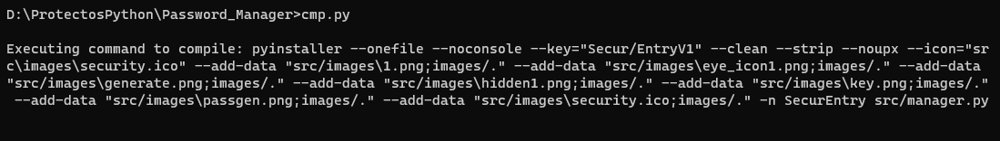

### SecurEntry (Windows)
Errors/Suggeriments ---> https://github.com/an0mal1a/SecurEntry/issues

---
# Descripcion
    Este es un repositorio para el desarrollo de un gestor de contraseñas seguro y fácil de usar desarrollado
    en Python. Almacena tus contraseñas de forma segura y accede a ellas fácilmente desde cualquier lugar. 
    Utiliza técnicas avanzadas de cifrado para proteger tus contraseñas y garantizar tu privacidad

# New

  1. Arreglado fallo al comprobar si la base de datos esta guardada.
  2. Arreglado fallo con funcion "exit()"

---
# Compilación:

#### Requirements
- Instalamos el archivo "requirements.txt" con el siguiente comando:

      pip install -r requirements.txt
---

    Al Ejecutar el archivo cmp.py te dará el comando necesario de pyinstaller para compilar
    a .exe el código.

  

- Manual Compile:

    Ejecutamos el siguiente comando:

      pyinstaller --onefile --noconsole --clean --strip --noupx --icon="src\images\shield.ico" --add-data "src/images\1.png;images/." --add-data "src/images\eye_icon1.png;images/." --add-data "src/images\generate.png;images/." --add-data "src/images\hidden1.png;images/." --add-data "src/images\key.png;images/." --add-data "src/images\net.ico;images/." --add-data "src/images\shield.ico;images/." -n SecurEntry src/manager.py

- Automated Compile:

      Ejecutamos el script "cmp.py", nos generará el .exe requerido

  
  
- Ejecución:

        Ejecutamos el .exe dentro de la carpeta "./dist" 

  

# Ayudar en el desarrollo

    Si te interesa ayudar en el desarrollo y/o testear la app en busca de errores:
            
            · Contacta por email a la siguiente direccion:

                    [ pablodiez024@proton.me ]