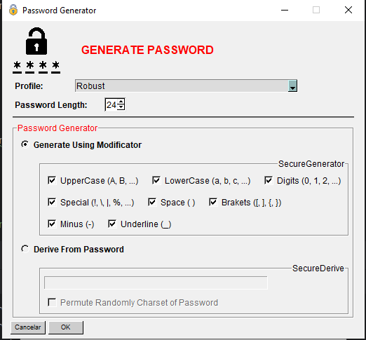

### SecurEntry (Windows)
Errors/Suggeriments ---> https://github.com/an0mal1a/SecurEntry/issues

En desarrollo...

---
# Descripcion
    Este es un repositorio para el desarrollo de un gestor de contraseñas seguro y fácil de usar desarrollado
    en Python. Almacena tus contraseñas de forma segura y accede a ellas fácilmente desde cualquier lugar. 
    Utiliza técnicas avanzadas de cifrado para proteger tus contraseñas y garantizar tu privacidad
---

# Informacion
- Para usar la compilación con C es necesario tener GCC y python3 instalado en el sistema y compilarlo manualmente.

# Download

[C Binary (RECOMENDADO)](#compilacion)

# New

  - **Compilación en C**

  Añadido calidad de contraseña (No va en base a bytes, se ha actualizado ligeramente la lógica de este repo)
     (https://github.com/gkbrk/passwordstrength)

  

  Añadido la opcion de abrir el password generator (Select options, derive from password):
  
  

---
# Compilacion:

#### Requirements

- GCC: MinGW 64 Bits [DOWNLOAD LINK](https://github.com/brechtsanders/winlibs_mingw/releases/download/13.2.0mcf-16.0.6-11.0.1-ucrt-r2/winlibs-x86_64-mcf-seh-gcc-13.2.0-llvm-16.0.6-mingw-w64ucrt-11.0.1-r2.7z)
- Python 3.8 - 3.11

- Instalamos el archivo "requirements.txt" con el siguiente comando:

      pip install -r requirements.txt

---

    Al Ejecutar el archivo cmp.py compilará el código con una clave de obfuscación por defecto.

  

- Manual Compile:

  Generamos el .c a través de .py:

      python -m cython --embed src/manager.py .o src/SecurEntry.c
  

  Compilamos con GCC:
  
      gcc -mwindows -municode -DMS_WIN64 .\src\SecurEntry.c -o .\src\SecurEntry -L $(python -c "import os, sysconfig; print(os.path.join(sysconfig.get_path('data'), 'libs'))") -I $(python -c "import sysconfig; print(sysconfig.get_path('include'))") -l python$(python -c 'import sys; print(\".\".join(map(str, sys.version_info[:2])).replace(\".\",\"\"))') .\src\images\icon.o

- Automated Compile:

### ATENCION: EL SCRIPT NO COMPRUEBA SI TIENES LOS REQUIREMENTS. EN CASO DE NO TENERLOS, NO FUNCIONARÁ

      Ejecutamos el script "cmp.py", nos generará el .exe requerido

  
  
- Ejecución:

        Ejecutamos el .exe dentro de la carpeta "src" 

# Ayudar en el desarrollo

    Si te interesa ayudar en el desarrollo y/o testear la app en busca de errores/fallos de seguridad:
            
            · Contacta por email a la siguiente direccion:

                    [ pablodiez024@proton.me ]