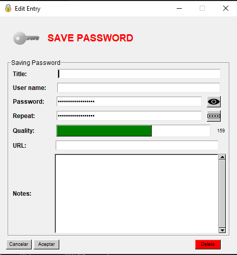

### SecurEntry (Windows)
Errors/Suggeriments ---> https://github.com/an0mal1a/SecurEntry/issues

En desarrollo...

---
# Descripcion
    Este es un repositorio para el desarrollo de un gestor de contraseñas seguro y fácil de usar desarrollado
    en Python. Almacena tus contraseñas de forma segura y accede a ellas fácilmente desde cualquier lugar. 
    Utiliza técnicas avanzadas de cifrado para proteger tus contraseñas y garantizar tu privacidad
---
# New

  **1.** Añadido calidad de contraseña (No va en base a bytes, se calcula utilizando reglas encontradas en Wolframa)
     (https://github.com/gkbrk/passwordstrength)
  

  **2.** Añadido la opcion de abrir el password generator (Select options, derive from password):
  

---
# Compilación:

#### Requirements
- Instalamos el archivo "requirements.txt" con el siguiente comando:

      pip install -r requirements.txt
---

    Al Ejecutar el archivo cmp.py compilará el código con una clave de obfuscación por defecto.

  

- Manual Compile:

    Ejecutamos el siguiente comando:

      pyinstaller --onefile --noconsole --key="Secur/EntryV1" --clean --strip --noupx --icon="src\images\security.ico" --add-data "src/images\1.png;images/." --add-data "src/images\eye_icon1.png;images/." --add-data "src/images\generate.png;images/." --add-data "src/images\hidden1.png;images/." --add-data "src/images\key.png;images/." --add-data "src/images\passgen.png;images/." --add-data "src/images\security.ico;images/." -n SecurEntry src/manager.py

- Automated Compile:

      Ejecutamos el script "cmp.py", nos generará el .exe requerido

  
  
- Ejecución:

        Ejecutamos el .exe dentro de la carpeta "./dist" 

  

# Ayudar en el desarrollo

    Si te interesa ayudar en el desarrollo y/o testear la app en busca de errores:
            
            · Contacta por email a la siguiente direccion:

                    [ pablodiez024@proton.me ]